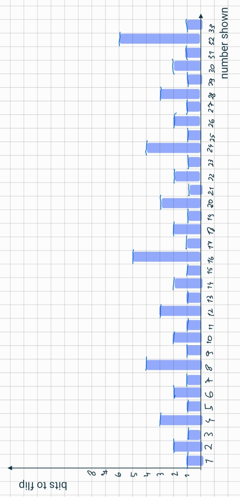
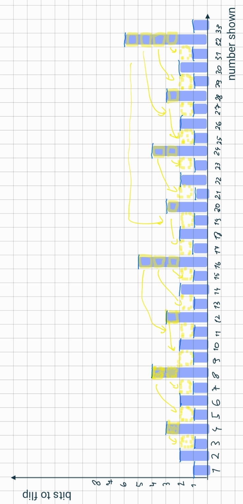
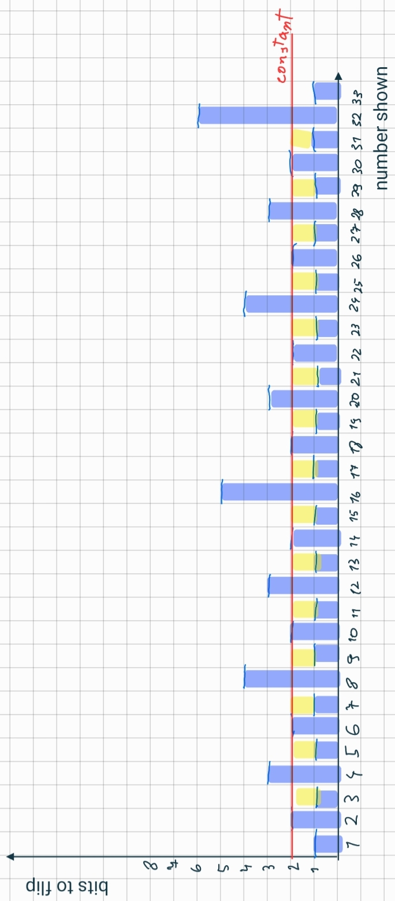

# ALDAST lab 02
Github fork used for this assignment: [repository](https://github.com/nokacper24/aldast-lab02)  
Contributors: 
- Kacper Lukasz Nowicki [kacperln@ntnu.no](mailto:kacperln@ntnu.no)
- Jakob Holkestad Molnes [jakobmo@ntnu.no](mailto:jakobmo@ntnu.no)

## Q1 Arrays
### Q1.1 Insertion
``` java
public void insert(int item) {  
    if (this.length == this.capacity) {  
        this.capacity *= 2;  
        // shorthand version of a for loop ( also more efficient )
        this.array = Arrays.copyOf(this.array, this.capacity);  
    }  
    this.array[this.length] = item;  
    this.length++;  
}
```

### Q1.2 Deletion
``` java
public void remove() {  
    // remove the last element of the array  
    this.array[this.length - 1] = 0;  
    this.length--;  
  
    if (this.length <= this.capacity / 4) {  
        this.capacity /= 2;  
        this.array = Arrays.copyOf(this.array, this.capacity);  
    }  
}
```
<div style="page-break-after: always;"></div>

### Q1.3 Lookup
``` java
public int lookup(int elem) {  
    int i = 0;  
    while (i < this.length) {  
        if (elem == this.array[i]) {  
            return i;  
        }  
        i++;  
    }  
    return -1;  
}
```

## Q2 Runtimes
### a)
1. $log{_2}{\ n}$ - flattens out further out
2. $\sqrt{n}$ - sublinear polynomial since $\sqrt{n} = n^{1 \over 2}$ 
3. $n$ - linear growth
4. $n(log{_2}{\ n})^2$ - 
5. $n^2$ - quadratic function
6. $n^3$ - cubic function
7. $1.8^n$ - expotential growth
8. $3^n$ - expotential growth with greater base (3 > 1.8)

### b)
Functions we choose: $n$ and $3^n$.  
Today, for problem size of 20, $n$ would take 20 time units.  
If computers were 1000 times faster, in 20 time units it would be able to compute $n = 20000$.

Today, for problem size of 20, $3^n$ would take $3 ^{20} =3486784401$ time units.  
If computers were 1000 times faster, in $3486784401$ time units, it would be able to compute $n = 26$.  

  

## Q3 Simultaneous Minimum and Maximum
### a)
``` cpp
Pair findMinMax(sequence) {
	if (sequence.length < 1) {
		throw RuntimeException;
	}
	
	int greatest = sequence.get(0);
	int smallest= sequence.get(0);
	
	int i = 1;
	while (i < sequence.length) {
		if (sequence.get(i) > greatest) {
			greatest = sequence.get(i);
		} else if (sequence.get(i) < smallest) {
			smallest = sequence.get(i)
		}
		i++;
	}
	return Pair(greatest, smallest)
}
```

<div style="page-break-after: always;"></div>

### b)
We assume that every operation takes 1 unit of time.  
We ignore return statement, since every algorithm will do it.
``` java
Pair findMinMax(sequence) {                      // time units general
	if (sequence.length < 1) {                   // 1+1
		throw RuntimeException;            // 1 ; only if true
	}
	
	int greatest = sequence.get(0);              // 1+1
	int smallest= sequence.get(0);               // 1+1
	
	int i = 1;                                   // 1
	while (i < sequence.length) {                // n +1
		if (sequence.get(i) > greatest) {        // n - 1 + 1 = n
			greatest = sequence.get(i); // 2 ;ignored in worst
		} else if (sequence.get(i) < smallest) { // n - 1 + 1 = n
			smallest = sequence.get(i)     // 2 ; n*2 in worst 
		}
		i++;                                     // n-1
	}
	return Pair(greatest, smallest)
}
```

In the worst case, the first if statement will return false, and the second true.  
the total runtime for the worst case would be  
$2+2+2+1+n+1+n+n+2*n+n-1 = 6*n + 7$  
in the worst case: $time(n) = 6*n + 7$  

In the worst case we compere twice, 2n.

### c)
worst: {5,4,3,2,1}  
best: {1,1,1,1,1}

<div style="page-break-after: always;"></div>

## Q4 Binary Counter
Power cost of showing numbers:  
  
Spikes can be divided and amortized:  
  
  
We can see that power cost gets amortized to a constant.